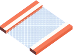
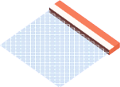
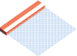
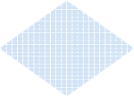

# Level file format

Each field on map is represented by `[type;function;id;durability;dangerous]`.
`type` is mandatory, every other attribute is optional and can be omited (then semicolons aren't needed). Rows are y-axis, columns – x-axis. Whitespace characters are ignored (inside and outside of brackets).

## `type`

 – "vertical track" – `[|]`

 – "horizontal track" – `[-]`

 – "up-right turn" – `[\_]`

 – "left-up turn" – `[_/]`

 – "down-right turn" – `[/~]`

 – "left-down turn" – `[~\]`

 – "closed from top" – `[-v-]`

 – "closed from right" – `[-|]`

 – "closed from bottom" – `[-^-]`

 – "closed from left" – `[|-]`

 – "opened from all sides" – `[+]`

Vertical and horizontal fields which aren't connected from one side will be replaced with one of the following:

Empty space can be achieved with `[x]`.

## `function`

- `s` – start, e.g. `[|;s]`
- `f` – finish, e.g. `[-;f]`
- `d|id` – deactivator, e.g. `[|;d|A]` — deactivates dangerous tile with id `A`
- `t|id` – teleport, e.g. `[-;t|A]` – teleports player to a tile with id `A`

## `id`

Any unique value which can be used by a `function`.

## `durability`

Is an integer which means how many times tile can be stepped before being destroyed, defaults to `1`.

## `dangerous`

If `d`, then field is "dangerous" and can't be stepped on until deactivated.
